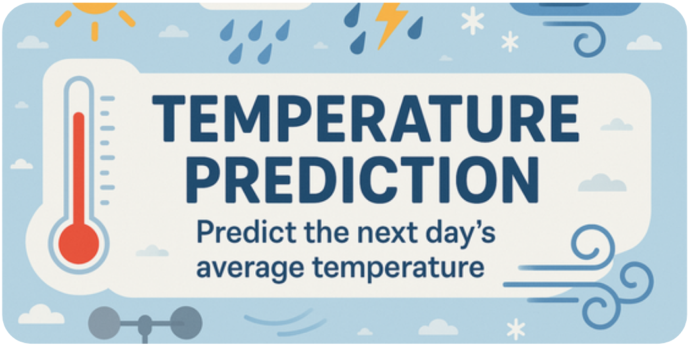
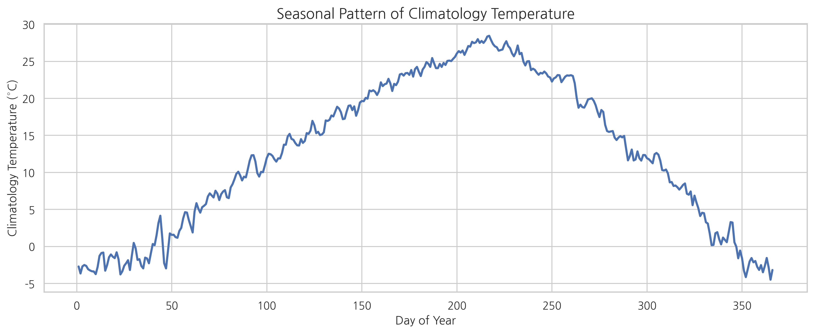
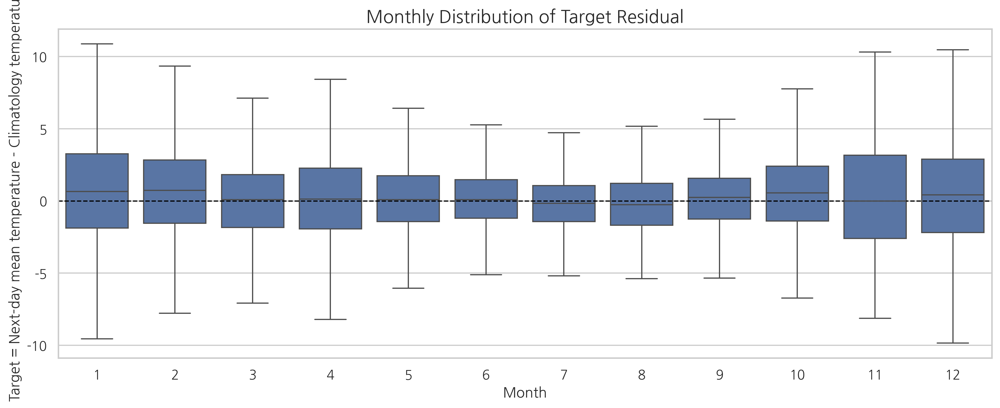
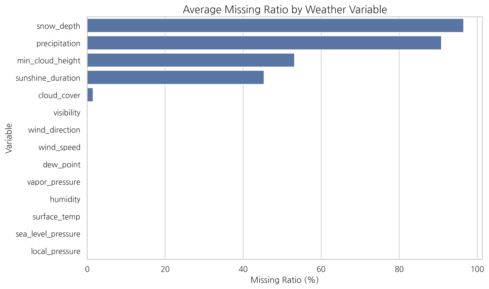
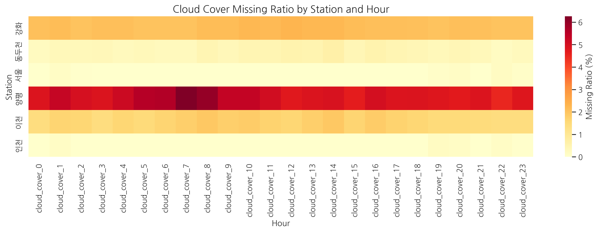
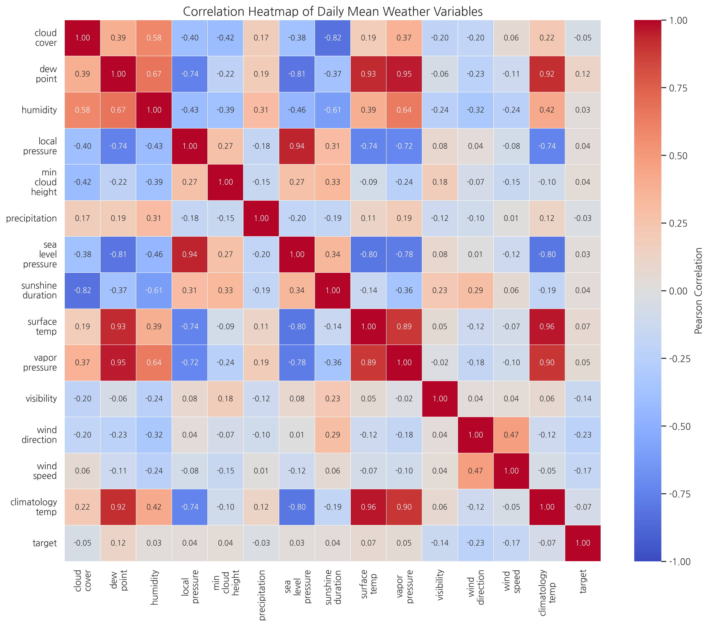
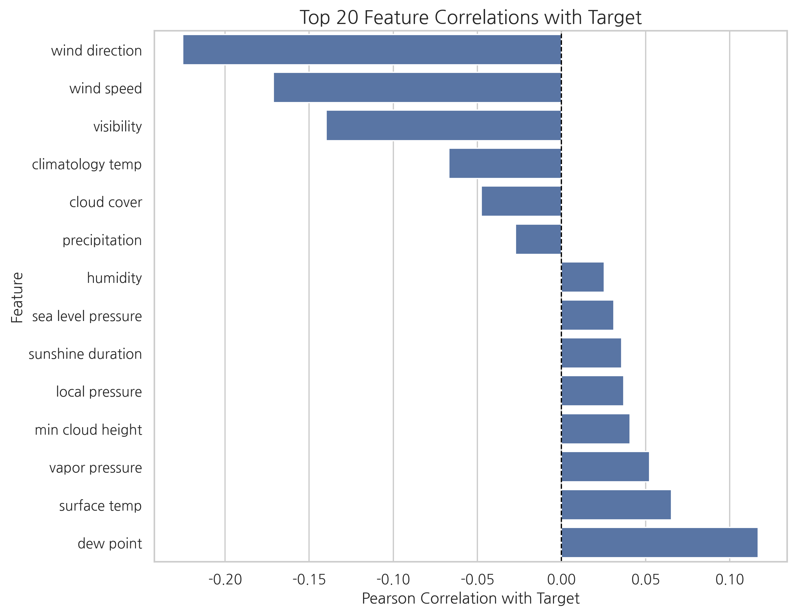
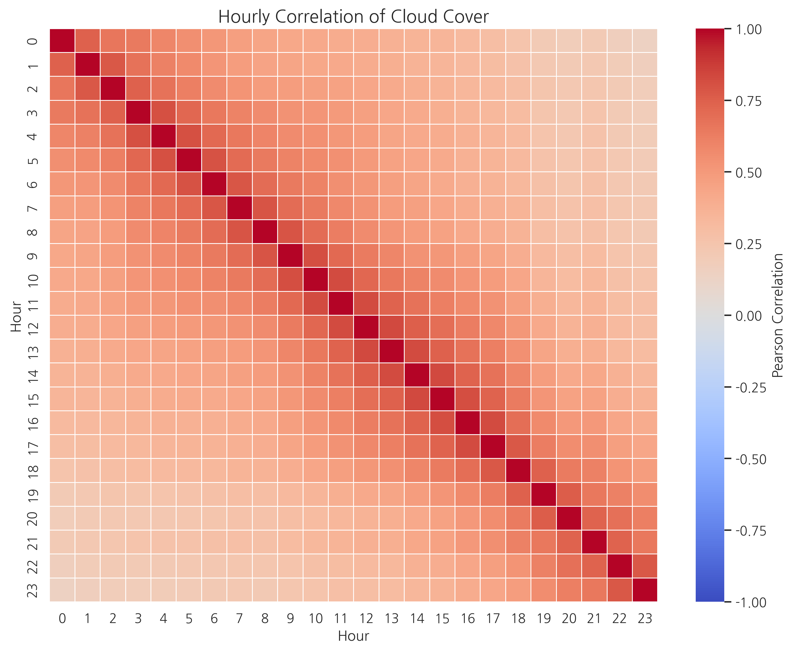
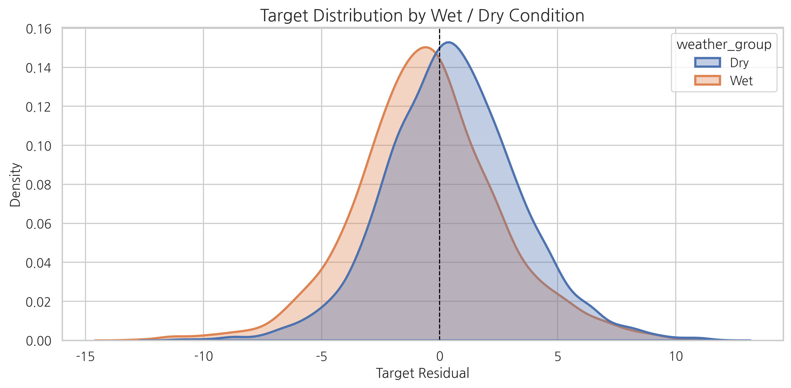
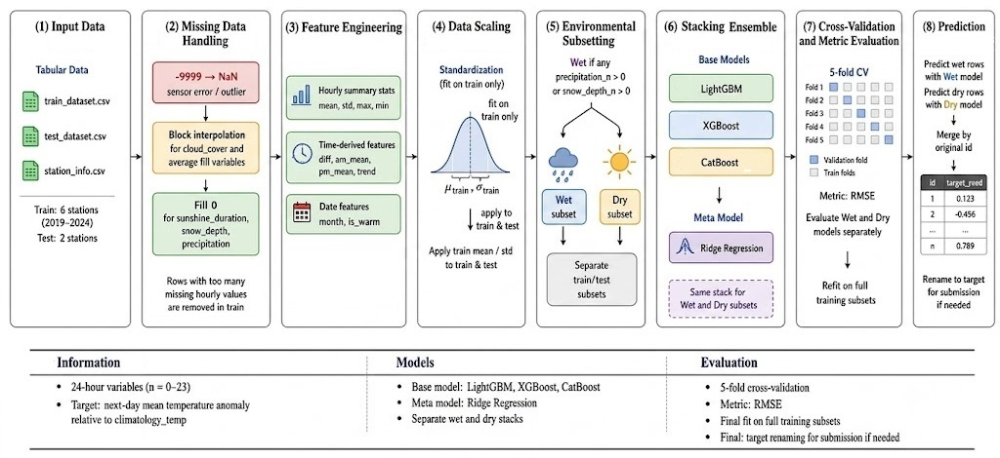

# Next-Day Air Temperature Forecast Challenge

This repository presents a modular machine-learning pipeline developed for the Next Day Air Temperature Forecast Challenge, a Kaggle-based course project for Machine Learning 1 at Seoul National University of Science and Technology in Spring 2025.

<p align="center">
  
</p>
[Competition Page](https://www.kaggle.com/competitions/next-day-air-temperature-forecast-challenge-2/data)


The goal of the competition was to predict the next day’s average temperature anomaly using hourly meteorological observations collected during the current day.

The target is not the raw next-day temperature. It is the residual value below:
```text
target = next_day_average_temperature - climatology_temp
```

Therefore, the model learns whether the next day is expected to be warmer or colder than the historical average for the same calendar date.


## Dataset

The official files are organized as follows:

```text
train_dataset.csv       # Training data from six stations, 2019–2024
test_dataset.csv        # Test data from Paju and Suwon stations
submission_sample.csv   # Sample submission format
station_info.csv        # Station metadata, including location and sensor heights
```

| Split | Rows | Columns | Stations |
|---|---:|---:|---|
| Train | 13,132 | 342 | Dongducheon, Seoul, Ganghwa, Incheon, Icheon, Yangpyeong |
| Test | 3,004 | 341 | Paju, Suwon |

Each row corresponds to one station-day. Most meteorological variables are provided as 24 hourly features, such as:

```text
dew_point_0, dew_point_1, ..., dew_point_23
humidity_0, humidity_1, ..., humidity_23
surface_temp_0, ..., surface_temp_23
precipitation_0, ..., precipitation_23
```

The main hourly feature groups are `cloud_cover`, `dew_point`, `humidity`, `local_pressure`, `min_cloud_height`, `precipitation`, `sea_level_pressure`, `snow_depth`, `sunshine_duration`, `surface_temp`, `vapor_pressure`, `visibility`, `wind_direction`, and `wind_speed`.

## Exploratory Data Analysis(EDA)

### 1. Climatology captures the dominant seasonal pattern

`climatology_temp` already contains the average temperature pattern for the same calendar date. As expected, it is lowest in winter and highest in summer.

<p align="center">
  
</p>

Because the target subtracts this seasonal baseline, the remaining prediction problem is focused on short-term weather anomalies rather than the raw annual temperature cycle.

### 2. The residual target is still irregular

Even after subtracting climatology, the residual target remains volatile. The project report interpreted this irregular component as important and connected it to weather-event conditions such as rain and snow.

<p align="center">
  
</p>

In the training set, the residual target has mean `0.222`°C and standard deviation `2.961`°C, with values ranging from `-12.86`°C to `11.78`°C.

### 3. Missing values require feature-specific interpretation

The raw data contains both `-9999` values and empty cells. The project treats `-9999` as a missing or abnormal sensor value. However, ordinary NaN values are not always the same type of error. For example, missing `snow_depth`, `precipitation`, or `sunshine_duration` can represent no snow, no rain, or nighttime/no sunshine.

<p align="center">
  
</p>

The highest raw missing rates were observed in:

| Feature group | Raw missing rate |
|---|---:|
| `snow_depth` | 96.51% |
| `precipitation` | 90.85% |
| `min_cloud_height` | 53.15% |
| `sunshine_duration` | 45.36% |
| `cloud_cover` | 1.54% |


This motivated different preprocessing rules for different variable types.

### 4. Cloud-cover missingness differs by station

The report found that `cloud_cover` is an ordinal variable with values from 0 to 10, but its missingness is not evenly distributed across stations. Some stations have almost no missing cloud-cover values, while Yangpyeong, Ganghwa, and Icheon contain much larger missing blocks.

<p align="center">
  
</p>

This supports using block interpolation for moderate missing sequences while filtering out rows with too many missing hourly values.

### 5. Feature correlation analysis

Because most meteorological variables are provided as 24 hourly columns, directly visualizing all hourly variables would make the correlation matrix too large and difficult to interpret. Therefore, each hourly feature group was first summarized into a daily mean feature, and the correlations among these daily-level variables were analyzed.

<p align="center">
  
</p>

The correlation heatmap shows that physically related weather variables are strongly connected. For example, temperature-related variables such as `surface_temp`, `dew_point`, and `vapor_pressure` tend to move together, while pressure-related variables also show strong relationships. This confirms that the dataset contains meaningful meteorological structure rather than independent tabular features.

However, the target variable is a residual after subtracting `climatology_temp`, so its relationship with individual daily-mean variables is weaker and less direct than the relationship among raw weather variables. This means that predicting the target requires capturing nonlinear interactions and conditional patterns rather than relying only on simple linear correlations.

<p align="center">
  
</p>

The target-correlation plot was used to identify which weather variables were more directly related to next-day temperature anomalies. Although several variables showed meaningful correlation with the target, no single feature was dominant enough to explain the residual alone. This supported the use of a tree-based ensemble model, which can learn nonlinear relationships and interactions among multiple meteorological variables.

In addition, `cloud_cover` was examined separately because it is an ordinal variable with values from 0 to 10 and had station-dependent missing patterns.

<p align="center">
  
</p>

The hourly correlation pattern of `cloud_cover` indicates that adjacent time points are related, but the variable still contains irregular fluctuations and station-specific missing blocks. Therefore, simple interpolation can be useful for short missing sequences, but rows with excessive missingness should be handled carefully.

### 6. Wet and dry days have different residual behavior

A row is defined as wet when at least one hourly `precipitation` or `snow_depth` value is greater than zero. Under this definition, the training set contains `4,133` wet rows (31.5%) and `8,999` dry rows (68.5%). The test set contains `765` wet rows (25.5%) and `2,239` dry rows (74.5%).

<p align="center">
  
</p>

The target distribution also differs between the two groups. Wet rows have mean `-0.530`°C and standard deviation `3.064`°C, while dry rows have mean `0.567`°C and standard deviation `2.846`°C. This distribution shift motivated training separate models for wet and dry conditions.

## Pipeline Architecture

The final implementation is organized as a reproducible preprocessing, feature-engineering, and split-specific ensemble pipeline.

<p align="center">
  
</p>

## Repository Structure

```text
.
├── config.py          # Global settings, feature groups, model parameters
├── preprocess.py      # Missing-value handling, interpolation, feature engineering, scaling
├── data.py            # CSV loading and wet/dry data splitting
├── models.py          # LightGBM, XGBoost, CatBoost, and stacking ensemble definitions
├── train.py           # Cross-validation, final training, prediction, and submission creation
├── main.py            # Command-line entry point
├── requirements.txt   # Required Python packages
├── README.md
└── image/
    ├── temperature_pipeline.png
    ├── eda_climatology_seasonality.png
    ├── eda_target_residual_by_month.png
    ├── eda_missing_ratio.png
    ├── eda_cloud_cover_missing_by_station.png
    ├── eda_variable_correlation_heatmap.png
    ├── eda_target_correlation_bar.png
    ├── eda_cloud_cover_hourly_correlation.png
    └── eda_wet_dry_target_distribution.png


```

## Preprocessing Strategy

### 1. Missing and abnormal values

The preprocessing logic follows the feature-specific interpretation from the EDA.

1. Convert all `-9999` values to `NaN`.
2. Apply block interpolation to selected continuous hourly variables.
3. Keep `cloud_cover` as an ordinal feature by flooring interpolated values.
4. Fill event-like variables with zero when missingness can indicate absence of the event.
5. Remove rows with excessive missingness in key interpolated variables.
6. Drop features that are too sparse or not useful enough for the final model.

Variables filled by zero:

```text
sunshine_duration
snow_depth
precipitation
```

Variables interpolated by hourly block interpolation:

```text
cloud_cover
wind_speed
wind_direction
visibility
vapor_pressure
surface_temp
sea_level_pressure
humidity
dew_point
```

Dropped columns:

```text
date
station
station_name
min_cloud_height
wind_direction
```

`min_cloud_height` was removed because it had very high missingness: approximately `53.2%` of all hourly cells were missing on average, and the worst hourly column exceeded `85.2%` missingness.

### 2. Feature engineering

The model uses original hourly variables and additional daily summary features.

For selected hourly variables, the pipeline creates:

```text
mean
standard deviation
maximum
minimum
```

For variables with important intraday movement, the pipeline also creates:

```text
daily difference
AM mean
PM mean
average hourly trend
```

Date-based features are generated from the `date` column:

```text
month
is_warm   # April to September
```

### 3. Train-based scaling

Selected hourly variables are standardized using only the training-set mean and standard deviation. The same training statistics are then applied to the test set to prevent test-set information leakage.

## Modeling

The model uses a split-specific stacking ensemble.

### Wet/dry routing

```text
wet row = any precipitation_hour > 0 or any snow_depth_hour > 0
dry row = otherwise
```

The model then trains two independent predictors:

```text
wet training rows -> wet stacking model
dry training rows -> dry stacking model
```

The same routing logic is applied to the test set before prediction, and the predictions are merged back into the original test order.

### Stacking ensemble

Base regressors:

```text
LightGBM Regressor
XGBoost Regressor
CatBoost Regressor
```

Meta learner:

```text
Ridge Regression
```

The final stacking structure is:

```text
[LGBM prediction, XGBoost prediction, CatBoost prediction] -> Ridge -> final residual prediction
```

The final submitted configuration used the following main parameters:

```text
LightGBM: n_estimators=5000, learning_rate=0.03, subsample=0.8, colsample_bytree=0.8
XGBoost : n_estimators=500,  learning_rate=0.03
CatBoost: n_estimators=500,  learning_rate=0.03
Ridge   : alpha=1.0
```
(Manual hyperparameter experiments were performed because full hyperparameter optimization was computationally expensive.)

## Validation and Experiments

The project used RMSE for local validation because the task is a regression problem. The report recorded separate wet/dry cross-validation scores:

| Split | Reported CV RMSE |
|---|---:|
| Wet | 1.5707 |
| Dry | 1.5263 |

The best recorded Kaggle score was `0.80942`, achieved with the final stacking ensemble and the wet/dry split strategy.

